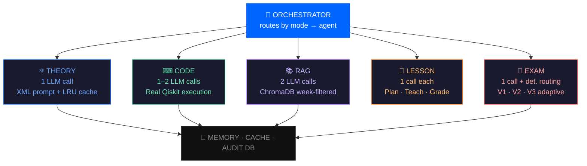

<div align="center">

<svg width="80" height="80" viewBox="0 0 80 80" fill="none" xmlns="http://www.w3.org/2000/svg">
  <rect width="80" height="80" rx="20" fill="#0066FF" fill-opacity="0.1"/>
  <ellipse cx="40" cy="40" rx="28" ry="11" stroke="#0066FF" stroke-width="2" fill="none"/>
  <ellipse cx="40" cy="40" rx="28" ry="11" stroke="#0066FF" stroke-width="2" fill="none" transform="rotate(60 40 40)"/>
  <ellipse cx="40" cy="40" rx="28" ry="11" stroke="#0066FF" stroke-width="2" fill="none" transform="rotate(120 40 40)"/>
  <circle cx="40" cy="40" r="5" fill="#0066FF"/>
</svg>

# QuantumMind

**Where quantum theory meets practice.**

A production-grade, multi-agent AI platform for quantum computing education —
built by a student who designed and taught the course it's based on.

[](https://python.org)
[](https://fastapi.tiangolo.com)
[](https://react.dev)
[](https://langchain-ai.github.io/langgraph/)
[](https://qiskit.org)
[](LICENSE)

[**🚀 Live Demo**](https://quantummind.vercel.app) &nbsp;·&nbsp; [**📖 Docs**](#-local-setup) &nbsp;·&nbsp; [**🔬 Research**](#-research-layer)

---

*"The people who are crazy enough to think they can change the world are the ones who do."*

</div>

<br/>

## The Idea

Most AI tutors are just chatbots with a quantum physics prompt.

QuantumMind is different. It's a **multi-agent system** where each learning mode is powered by a dedicated LangGraph agent — one that actually runs your Qiskit code, grades your understanding on three dimensions, and adapts its questions based on your answers.

It's the platform I wish existed when I designed and taught the University of Debrecen's first Quantum Computing course for 60+ students. So I built it.

<br/>

## 🎓 Five Ways to Learn

<div align="center">

| | Mode | Description | Access |
|---|---|---|---|
| ⚛ | **Theory** | AI tutor that infers your level from your question. Ask in plain English or Dirac notation — it adapts. |  |
| ⌨ | **Practice** | Monaco editor (VS Code engine). Write Qiskit, hit Run, see your circuit diagram appear as a live image. |  |
| 🎯 | **Guided** | Step-by-step lessons with mandatory check questions. You cannot advance until you demonstrate understanding. |  |
| 🎓 | **13-Week Course** | |  |
| 📝 | **Exam Mode** | V1 static · V2 conditional · V3 fully adaptive. Scored on accuracy, reasoning, clarity. Voice input. Full audit trail. |  |

</div>

<br/>

## 🏗 Architecture

<div align="center">



</div>

### Why it's fast

| Decision | What we did | Latency saved |
|---|---|---|
| **Deterministic routing** | Follow-up decision uses `score < 5.0` threshold — zero LLM | ~2s per turn |
| **Deterministic sanitization** | Deprecated Qiskit replaced by string substitution | ~2s per code fix |
| **LRU cache** | Common theory questions answered from cache | ~3s → ~50ms |
| **Progress events** | SSE sends "Thinking…" in <100ms before LLM responds | perceived latency |
| **1-call prompts** | XML-structured prompts replace analyze→generate→grade loops | ~6s per request |

<br/>

## 🤖 The Seven Agents

<details>
<summary><b>01 · Theory Agent</b> — 1 LLM call + cache</summary>

**What it does:** Infers student level from question phrasing (beginner/intermediate/advanced) and generates a calibrated explanation with proper Dirac notation. Streams tokens directly.

**Key design:** XML-structured system prompt replaces the old analyze→generate→grade reflection loop. Common questions (what is superposition?, explain entanglement) are cached for 1hr — served in ~50ms.

```python
# Single node graph
generate_response → END
```
</details>

<details>
<summary><b>02 · Code Agent</b> — 1–2 LLM calls</summary>

**What it does:** Generates Qiskit code + explanation in one structured call, then actually executes it in a subprocess. If it fails, retries once with the error context.

**Key design:** `temperature=0.1` for code generation — maximum reliability. Deprecated syntax (`Aer.get_backend()`, `execute()`) is fixed deterministically before execution. Returns real output + circuit diagram as base64 PNG.

```python
# Conditional retry loop
generate → execute → (fail?) → increment_retry → generate → execute → assemble → END
```
</details>

<details>
<summary><b>03 · RAG Agent</b> — 2 LLM calls</summary>

**What it does:** Retrieves relevant chunks from ChromaDB filtered by week number, generates an answer grounded in course materials, grades the answer quality.

**Key design:** Week-based metadata filtering means a student in Week 3 only gets answers from Week 3 content — not the entire course. Falls back to general knowledge if no materials uploaded.
</details>

<details>
<summary><b>04 · Lesson Agent</b> — 1 LLM call per operation</summary>

**What it does:** Three separate graphs — plan (generates 3-4 step lesson), teach (explains one step), grade (evaluates student answer). Each is 1 LLM call.

**Key design:** Deprecated Qiskit patterns in generated code are sanitized deterministically — a lookup table of string replacements runs before the student ever sees the code.
</details>

<details>
<summary><b>05 · Exam Agent</b> — 1 LLM call + deterministic routing</summary>

**What it does:** Generates exam questions for V1 (static bank), V2 (fixed + conditional follow-up), or V3 (fully adaptive based on previous answers).

**Key design:** The follow-up decision is 100% deterministic — `avg_score < 5.0` → generate follow-up. Zero LLM calls for this routing decision. Saves ~2s per turn.
</details>

<details>
<summary><b>06 · Grade Agent</b> — 1 LLM call</summary>

**What it does:** Scores student answers on three dimensions: **Accuracy** (0–10), **Reasoning** (0–10), **Clarity** (0–10). Returns justification and an ideal answer for benchmarking.

**Key design:** All three scores + justification + ideal answer returned in one structured JSON response. The old analyze→grade loop (2 calls) is merged into one.
</details>

<details>
<summary><b>07 · Orchestrator</b> — 0 LLM calls</summary>

**What it does:** Routes incoming requests to the correct agent based on mode. `course` → RAG, `practice` → Code, `exam` → Exam, else → Theory.

**Key design:** Mode-based routing is deterministic. Only falls back to LLM classification for ambiguous free-form messages in Theory/Guided mode.
</details>

<br/>

## 🔬 Research Layer

Aligned with **ETH Zurich's Agentic AI in Education** project direction.

### Research Questions

| | Question |
|---|---|
| **RQ1** | To what extent do AI rubric scores agree with human teacher scores across accuracy, reasoning, and clarity? |
| **RQ2** | Do V3 (adaptive) exam students score higher than V1 (static) students on the same topic? |
| **RQ3** | Can the reasoning dimension reliably identify vague answers that accuracy alone misses? |
| **RQ4** | Do students who receive follow-up questions improve on subsequent turns? |

### Audit Trail

Every exam event is logged to an **append-only** SQLite database. Nothing is ever deleted or updated — only appended. This guarantees reproducibility and fairness.

```sql
exam_sessions   -- session_id, student_name, topic, version (V1/V2/V3), avg_score
exam_turns      -- question, answer, score_accuracy, score_reasoning, score_clarity
                --   ai_justification, ideal_answer, is_followup
teacher_reviews -- ai_scores, teacher_override_scores, delta, feedback, action
manual_labels   -- ground truth labels for vague answer detection (Experiment 3)
```

### Three Experiments

<details>
<summary><b>Experiment 1</b> — AI vs Human Grading Agreement</summary>

**Goal:** Measure how reliable AI rubric scoring is compared to human experts.

**Participants:** 15 exam sessions · 2 independent reviewers

**Method:**
1. Run 15 exam sessions (any version, any topic)
2. Both reviewers independently score all turns via teacher dashboard
3. Compare reviewer scores vs AI scores

**Metrics:** Pearson r per dimension (target > 0.7), MAE, agreement rate (|delta| ≤ 1.0)

**Publishable claim:** *"AI rubric scoring achieves r=X agreement with human experts on quantum computing oral examinations"*
</details>

<details>
<summary><b>Experiment 2</b> — Adaptive vs Static Questioning</summary>

**Goal:** Show V3 produces better learning outcomes than V1.

**Participants:** 30 students (10 per version)

**Method:**
1. Randomly assign students to V1, V2, or V3
2. All students take exam on the same topic (e.g. Quantum Superposition)
3. One week later, same students take V1 post-test on same topic
4. Compare pre/post score changes by group

**Metrics:** Cohen's d for V3 vs V1, % improvement from pre to post-test

**Publishable claim:** *"Adaptive multi-turn questioning improves post-test scores by X% vs static questioning"*
</details>

<details>
<summary><b>Experiment 3</b> — Vague Answer Detection</summary>

**Goal:** Validate that the reasoning dimension catches weak answers that accuracy alone misses.

**Participants:** 50 existing exam turns (no new students needed)

**Method:**
1. Manually label 50 turns as: "strong" / "vague" / "incorrect"
2. Compare labels to AI reasoning scores
3. Measure precision/recall of reasoning as vague-answer detector

**Metrics:** Precision, recall, F1 score vs accuracy-only baseline

**Publishable claim:** *"Reasoning-dimension scoring detects vague answers with precision=X vs accuracy-only baseline"*
</details>

**Target venues:** EDM 2026 · LAK 2026 · AIED 2026

<br/>

## ⚡ Tech Stack

<div align="center">

| Layer | Technology | Why |
|-------|-----------|-----|
| **AI Framework** | LangGraph 0.2 | Stateful graphs with conditional edges and memory |
| **LLM** | Groq llama-3.1-8b-instant | 500+ tokens/sec · free tier · sufficient quality |
| **RAG** | ChromaDB + HuggingFace all-MiniLM-L6-v2 | Local · free · no API key required |
| **Code Execution** | Qiskit + AerSimulator | Real quantum simulation in subprocess |
| **Circuit Diagrams** | matplotlib `qc.draw('mpl')` | base64 PNG returned directly to frontend |
| **Backend** | FastAPI + SSE streaming | Async · real-time token streaming |
| **Frontend** | React 18 + Vite + Framer Motion | Fast · animated · production-quality |
| **Editor** | Monaco (VS Code engine) | Syntax highlighting · themes · resizable |
| **Memory** | LangGraph MemorySaver | Thread-based conversation persistence |
| **Cache** | In-memory LRU (200 items, 1hr TTL) | Repeated questions answered instantly |
| **Audit DB** | SQLite append-only | Exam trails · teacher overrides · research data |
| **Voice** | Web Speech API | Browser-native · zero backend changes |
| **Hosting** | Railway + Vercel | Free tier · zero cost |

</div>

<br/>

## 🚀 Local Setup

### Prerequisites

```
Python 3.12+    →  python.org
Node.js 18+     →  nodejs.org
uv              →  curl -LsSf https://astral.sh/uv/install.sh | sh
Groq API key    →  console.groq.com (free)
```

### Backend

```bash
cd backend

# Install all dependencies
uv sync

# Configure environment
cp .env.example .env
# Add GROQ_API_KEY to .env

# Start server
uv run uvicorn app.main:app --reload --port 8000
# API docs → http://localhost:8000/docs
```

### Frontend

```bash
cd frontend
npm install
npm run dev
# App → http://localhost:5173
```

### Environment Variables

```env
GROQ_API_KEY=gsk_...              # from console.groq.com
GROQ_MODEL=llama-3.1-8b-instant   # or llama-3.3-70b-versatile
APP_ENV=development
FRONTEND_URL=http://localhost:5173
TEACHER_PASSWORD=your_password    # for /teacher dashboard
```

### Upload Course Content

```bash
# Upload lecture notes for Week 1
curl -X POST http://localhost:8000/api/upload \
  -F "file=@lecture_week1.pdf" \
  -F "week=1"

# Upload Jupyter notebook for Week 3
curl -X POST http://localhost:8000/api/upload \
  -F "file=@lab_week3.ipynb" \
  -F "week=3"

# Check what's indexed
curl http://localhost:8000/api/upload/status
```

<br/>

## 📁 Project Structure

```
quantummind/
├── backend/
│   └── app/
│       ├── agents/
│       │   ├── theory_agent.py       # 1 call · XML prompt · LRU cache
│       │   ├── code_agent.py         # generate → execute → fix loop
│       │   ├── rag_agent.py          # ChromaDB retrieval + grading
│       │   ├── lesson_agent.py       # plan + teach + grade (1 call each)
│       │   ├── exam_agent.py         # V1/V2/V3 adaptive questioning
│       │   └── orchestrator.py       # deterministic mode-based routing
│       ├── core/
│       │   ├── config.py             # pydantic settings
│       │   ├── memory.py             # MemorySaver checkpointer
│       │   ├── cache.py              # LRU cache (200 items)
│       │   └── prompts.py            # system prompts
│       ├── db/
│       │   └── audit_db.py           # append-only SQLite audit trail
│       └── routes/
│           ├── stream.py             # SSE streaming + progress events
│           ├── execute.py            # Qiskit execution + circuit PNG
│           ├── upload.py             # PDF/notebook → ChromaDB
│           ├── lesson.py             # guided lesson API
│           └── exam.py               # exam + teacher + research API
└── frontend/
    └── src/
        ├── components/
        │   ├── LandingPage.jsx       # Jobs-style · dark/light toggle
        │   ├── ModeSelector.jsx      # 5 modes · 3+2 grid
        │   ├── ChatPanel.jsx         # streaming · progress indicators
        │   ├── CodeEditor.jsx        # Monaco + Run + circuit diagram
        │   ├── GuidedPanel.jsx       # step-by-step lesson UI
        │   ├── CoursePanel.jsx       # RAG lesson + Ask AI
        │   ├── CourseSidebar.jsx     # 13-week curriculum tree
        │   ├── ExamMode.jsx          # V1/V2/V3 + voice input
        │   └── TeacherDashboard.jsx  # review + override + research
        ├── data/
        │   └── curriculum.js         # 13-week course structure
        └── hooks/
            └── useAppState.js        # Zustand global state
```

<br/>

## 👤 About

<div align="center">

**Asfand Yar** — BSc Computer Science, University of Debrecen, Hungary *(graduating August 2027)*

</div>

| Achievement | Detail |
|---|---|
| 🎓 **Course Designer** | Designed and taught University of Debrecen's first Intro to Quantum Computing course — 60+ students |
| ⚛ **Qiskit Fall Fest 2025** | Led the event with 120+ participants |
| 👥 **GDG Debrecen** | Co-Lead, Google Developer Groups Debrecen |
| 🏛 **Student Union** | VP, International Students' Union |
| 🔬 **BSc Thesis** | JEPA-RobustViT — Joint Embedding Predictive Architectures + Vision Transformers + Test-Time Adaptation |
| 🌐 **GSoC 2026** | Proposal submitted: Kubeflow docs-agent |

**Research interests:** Agentic AI systems · AI in education · Quantum computing

<div align="center">

[](https://github.com/asfandyar-prog)
[](https://linkedin.com/in/asfand-yar-3966b8291)
[](mailto:yarasfand886@gmail.com)

</div>

<br/>

## 🔗 Related Repositories

| Repository | Description |
|-----------|-------------|
| [quantum-insight-rag](https://github.com/asfandyar-prog/quantum-insight-rag) | Original RAG system for quantum computing docs |
| [framework-free-agent](https://github.com/asfandyar-prog/framework-free-agent) | ReAct agent built from scratch without frameworks |
| [agentic-systems-with-langgraph](https://github.com/asfandyar-prog/agentic-systems-with-langgraph) | LangGraph workflow experiments |
| [fastapi-ai-backend](https://github.com/asfandyar-prog/fastapi-ai-backend) | FastAPI backend architecture patterns |

<br/>

---

<div align="center">

**QuantumMind** · University of Debrecen · 2026

*Built with intention. Every component earned its place.*

</div>
